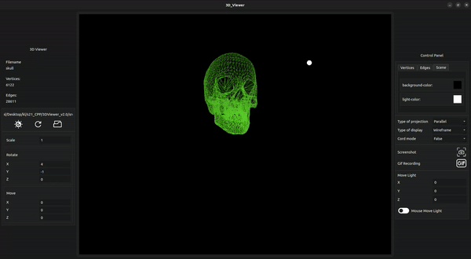

# 3DViewer v2.0

This project is part of the curriculum of [School 21](https://21-school.ru/). Based on the task, a 3DViewer program was implemented to view 3D wireframes, as well as various transformations and movements using affine transformations. The program was written in pure C++, following the principles of OOP, and the Qt framework was used for the user interface (UI).

## Contents

- [3DViewer v2.0](#3dviewer-v20)
  - [Contents](#contents)
  - [Installation and commands](#installation-and-commands)
        - [Makefile targets:](#makefile-targets)
  - [Project overview](#project-overview)
  - [Tests](#tests)
  - [Technical specifications](#technical-specifications)
    - [Bonus. Settings](#bonus-settings)
    - [Bonus. Record](#bonus-record)

## Installation and commands

You will need the following utilities to install `gcc`, `make` and `Cmake`

##### Makefile targets:

- **install**  
  Installs the 3DViewer in the build folder and on the desktop

- **uninstall**  
  Uninstall the 3DViewer

- **dvi**  
  Opens project documentation

- **dist**  
  Generates distribution `.tgz` with an executable and necessary documentation

- **test**  
  Start testing 3DViewer modules and its controller. The report can be viewed in the `/tests/logs` folder

- **gcov_report**  
  Generates an html report displaying the coverage of all functions by tests

- **style_check**
  Checks the code for compliance with Google Style

- **format_style**
  Formats the code for Google Style

- **valgrind_check**  
  Initializes the check of the project by the valgrind utility, after which log files with reports are created

- **clean & fclean** 
  Cleaning up unnecessary files

## Project overview

## Tests

- Tests were written using [Google Tests](https://github.com/google/googletest.git) library

## Technical specifications

- The program is developed in C++ language of C++17 standard;
- The program code is located in the src folder;
- The code follows the Google style;
- The program is built using a Makefile that contains the standard set of targets for GNU programs: all, install, uninstall, clean, dvi, dist, tests;
- The program is designed according to the principles of object-oriented programming; 
- Full coverage of modules related to model loading and affine transformations, unit tests;
- Only one model on the screen at a time;
- The program provides the ability to:
    - Load a wireframe model from an obj file (vertex and surface list support only);
    - Move the model at a specified distance relative to the X, Y, Z axes;
    - Rotate the model by a specified angle relative to X, Y, Z axes;
    - Scale the model by a specified value;
- GUI implementation based on any GUI library with API for C++:
  * For Linux: Qt;
  * For Mac: Qt;
- The GUI contains:
    - A button to select a model file and a field to display its name;
    - A visualization area for the wireframe of the model;
    - Button/buttons and input fields for model translation;
    - Button(s)/buttons and input fields for rotating the model;
    - Button(s)/buttons and input fields for model scaling;
    - Information about the loaded model - file name, number of vertices and edges;
- The program correctly processes and allows the user to view models with details up to 100, 1000, 10,000, 100,000, 1,000,000 vertices without freezing (freezing is inactivity of the interface for more than 0.5 seconds);
- The program is implemented using the MVC pattern, and:
    - there is no business code in the view code;
    - there is no interface code in the controller and model;
    - the controllers are thin;
- Classes are implemented in the `s21` namespace;

### Bonus. Settings

- The program shall allow to configure the type of projection (parallel and central);
- The program shall allow you to configure the type (solid, dashed), color and thickness of edges, display method (none, circle, square), color and size of vertices;
- The program allows you to choose the background color;
- Settings are saved between program restarts.

### Bonus. Record

- The program allows to save captured (rendered) images as bmp and jpeg files;
- The program allows to record small screencasts - current user affine transformation of the loaded object into gif-animation (640x480, 10fps, 5s) by special button.